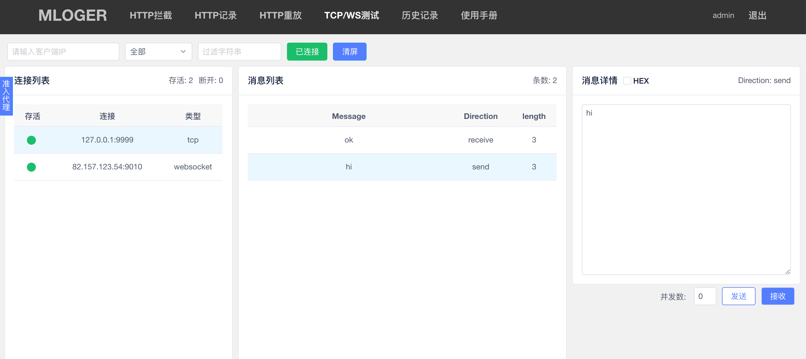
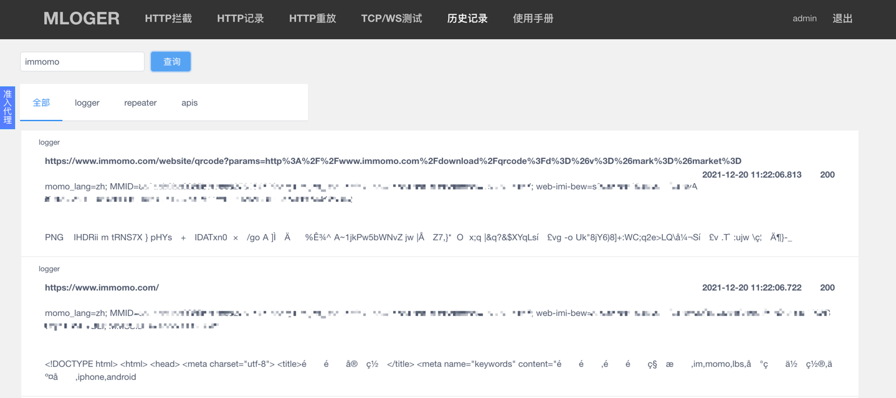

## 准备工作
如果你已经使用了`just trust me`或通过其他方式解决了`SSL Pinning`，可直接跳过此步骤。  
否则请继续执行下列操作。  
1. 将手机代理挂载到服务端开放的HTTP代理端口上
2. 使用手机浏览器访问`mitm.it`，下载证书
3. 将证书插入系统证书库，并信任
4. 打开要抓包的应用

## Web功能
### 准入代理

- 入口：页面左侧悬浮窗是准入代理功能，鼠标悬浮于图标上可触发。准入代理是用于授权可以通过代理访问的客户端ip，用于对代理进行权限控制。
- 授权与撤销：点击接入即可授权成功，再次点击撤销可撤回对该ip的授权。授权的客户端ip会在持续无流量三分钟后失效。  
- 拦截状态字段：拦截状态标识是指客户端ip是否在HTTP拦截中设置了拦截状态，若出现HTTP记录页仅展示请求无响应时，可通过观察该标识判断是否是因为开启了拦截导致。

### HTTP拦截
- 拦截：填入IP并点击拦截已关闭按钮将拦截该IP的所有HTTP请求，并将下一个拦截到的HTTP请求展示在当前页面。
- 修改：展示在当前文本框中的请求可修改请求体部分，其他部分暂不支持修改。
- 操作：修改过后点击放过、丢弃按钮可对当前修改过的请求进行操作，将修改过的请求替代原始请求发送至服务端。点击重放可将当前停留的请求发送至HTTP重放页面，进行更加自定义的重访操作。
- 等待响应：勾选等待响应后，点击放过按钮，将会等待此次放过请求的响应，并将该响应展示到文本框中，响应也可以被执行修改、放过、丢弃等操作。

### HTTP记录
- 连接：输入IP字段以过滤指定客户端ip的流量，否则你将会看到所有的流量，然后点击未连接按钮，即可连上服务端并获取实时的流量数据。再次点击已连接可断开连接。
- 过滤：filter输入框是用于前端过滤流量的，所以所有流量还是缓存在浏览器中的。
- 清屏：会清除当前页面所有HTTP记录。
- 描述：用于标记api的功能描述，后续相同接口的api将会带有描述展示。
- 优化：优化展示json格式的请求体与响应体，可通过原始切换查看原始请求与响应。
- 重放：点击重放即可跳转到该次请求详情的重放页面，进行下一步的测试。
- 分享：点击分享可将流量详情的链接复制到剪切板上。

### HTTP重放
- 重放：点击GO即可重放当前Request输入框中的HTTP请求。其中保留ua、HTTPS为重放时的可选项。
- 格式转换：Tojson、ToRaw按钮为转换请求体中的参数格式，Tojson可将普通格式转换成json格式参数，ToRaw可将json格式参数转换成普通格式。
- 并发：通过add §、clear § 按钮为请求添加可变参数，在payload设置按钮填入自定义字典来替换可变参数以进行有规律的遍历请求。支持的并发类型有四种（与burpsuite的intruder同）。若不添加§符号并修改并发数，可直接并发重放原始数据包。
- 并发详情：通过分享链接查看并发请求时，可在页面下方单独查看每个请求的详情。
- 最近20条：鼠标划过历史记录按钮，可查看最近20条请求重放记录。

### TCP/WS测试
- 连接：输入IP字段以过滤指定客户端ip的流量，否则你将会看到所有的流量，然后点击未连接按钮，即可连上服务端并获取实时的流量数据。再次点击已连接可断开连接。
- 过滤：filter输入框是用于前端过滤流量的，所以所有流量还是缓存在浏览器中的。
- 清屏：会清除当前页面所有Websocket、tcp记录。
- 重放：点击发送、接收按钮可向服务端、客户端发送当前消息详情内的消息，通过修改并发数，可发送多条消息。
- 16进制：点击HEX复选框可以16进制的形式查看、修改当前消息。

### 历史记录
- 搜索：从数据库中搜索历史记录，可选择不同类别。logger是记录的所有经过代理的HTTP流量，repeater是所有使用HTTP重放功能的流量，apis是归类了所有经过代理的接口请求。

